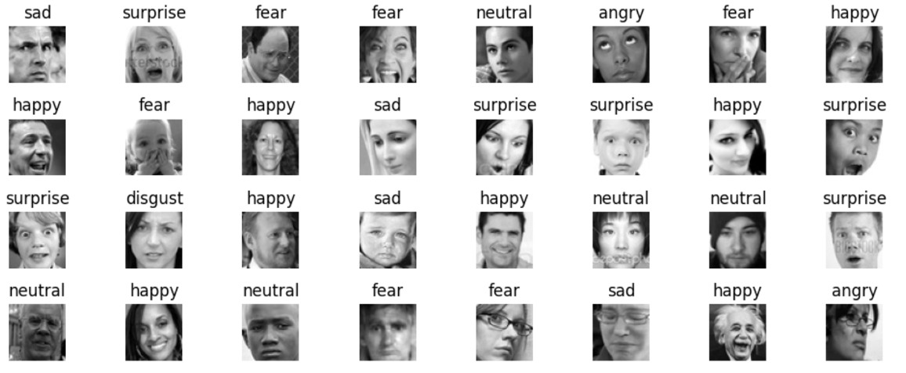
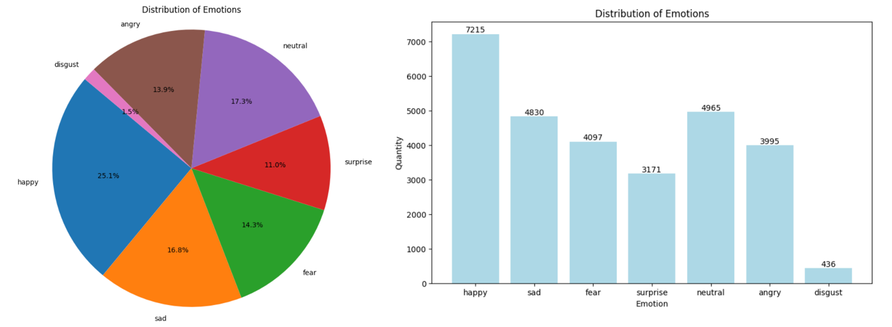
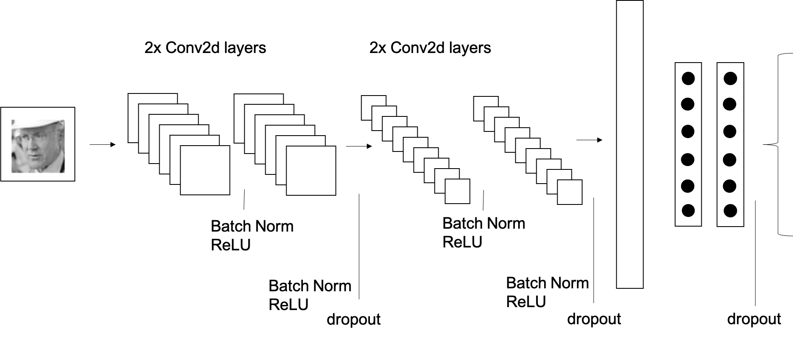
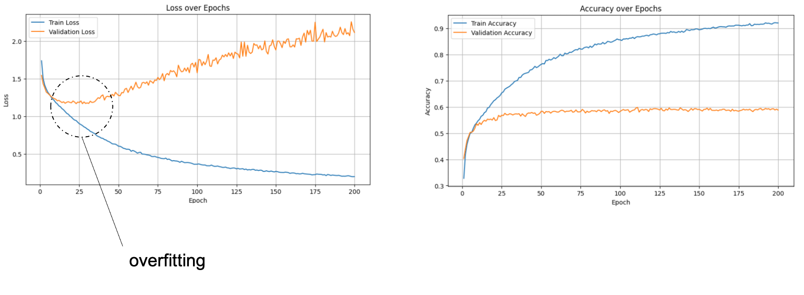
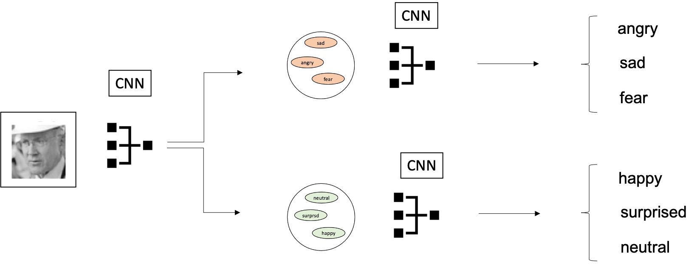
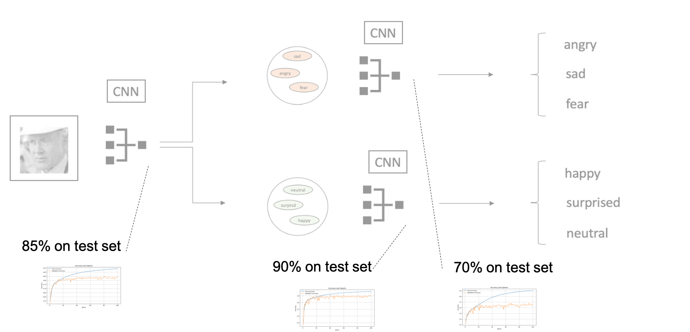
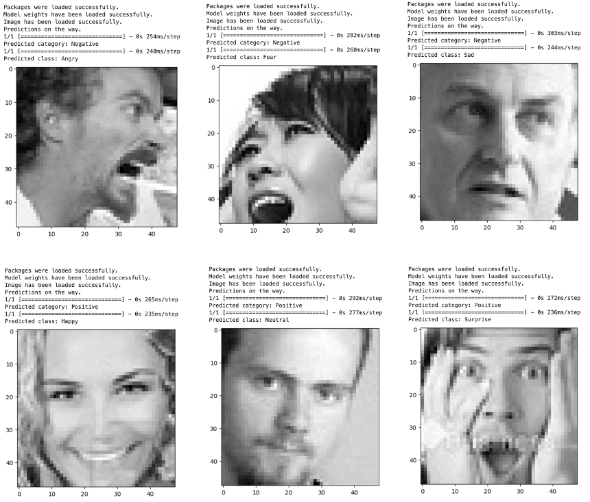
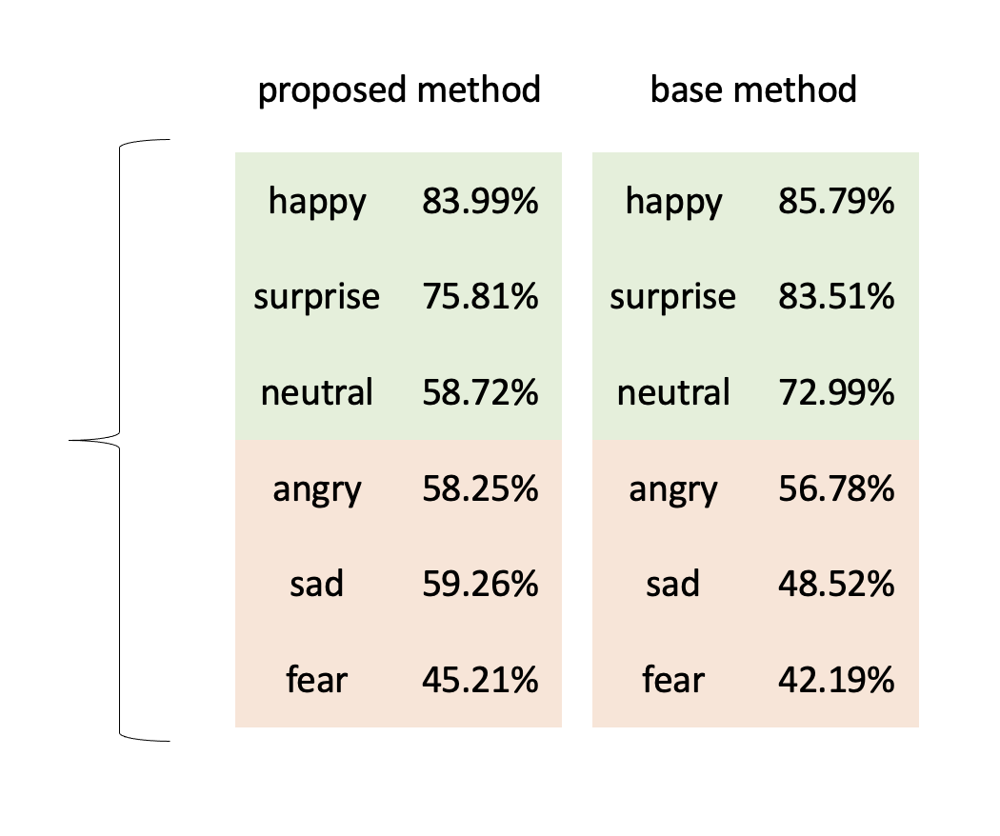

# FER-2013 Facial Expression Classification

### Author: Georgios Athanasiou

 

## Introduction

The FER-2013 dataset, composed of 35,887 grayscale images illustrating seven facial expressions, serves as a pivotal benchmark in automated emotion recognition. This repository details the approach, challenges, and results of designing a classifier for this dataset.

## Table of Contents
1. [Data Preparation](#data-preparation)
2. [Strategy](#strategy)
3. [Novelty](#novelty)
4. [Results](#results)
5. [Discussion](#discussion)

## Data Preparation

The dataset revealed a skewed distribution among facial expressions. Notably, the 'disgust' class was underrepresented. Other complexities included ambiguous facial expression labels. Strategies employed included:

 

- **Oversampling**: Addressing class imbalance.
- **Exclusion of 'disgust' class**: Due to its limited representation and inherent complexities.

## Strategy

Deep learning, specifically Convolutional Neural Networks (CNNs), was used for the classification task. The progression included:

 

- Initial CNN model with a validation accuracy of ~60%.

 

- Benchmark research: Top Kaggle models had an average accuracy of 65%. A notable paper reached 67.2% using an ensemble approach.
- Experimentation with vgg13 and vgg16 architectures.
- Use of both TensorFlow and PyTorch for model development, with TensorFlow yielding superior results.

 

## Novelty

A two-tiered approach was employed:

1. **Binary emotion classification**: Classifying facial expressions into 'Negative' and 'Positive' emotional spectrums. Achieved a validation accuracy of 85%.
2. **Granular emotion classification**: Specific models for 'Positive' and 'Negative' emotions yielded validation accuracies of 90% and 70% respectively.

 

## Results

 

- **Positive expressions**: Consistent performance on both validation and test sets.
- **Negative expressions**: Improved accuracy on test set compared to existing literature models.
- **Neutral expression**: Declined performance on the test set.

 

 

## Discussion

While the current progress is notable, there's room for enhancement:

- **Transfer Learning**: Greater incorporation of its benefits.
- **Exploration of architectures and loss functions**: Many avenues remain unexplored.
- **Generative Adversarial Networks (GANs)**: Using GANs for data augmentation holds potential.
- **Sophisticated Approaches**: Detecting subtle facial cues could significantly enhance the classification accuracy.

---

### Contributions

Contributions, feedback, and improvements are welcome!

